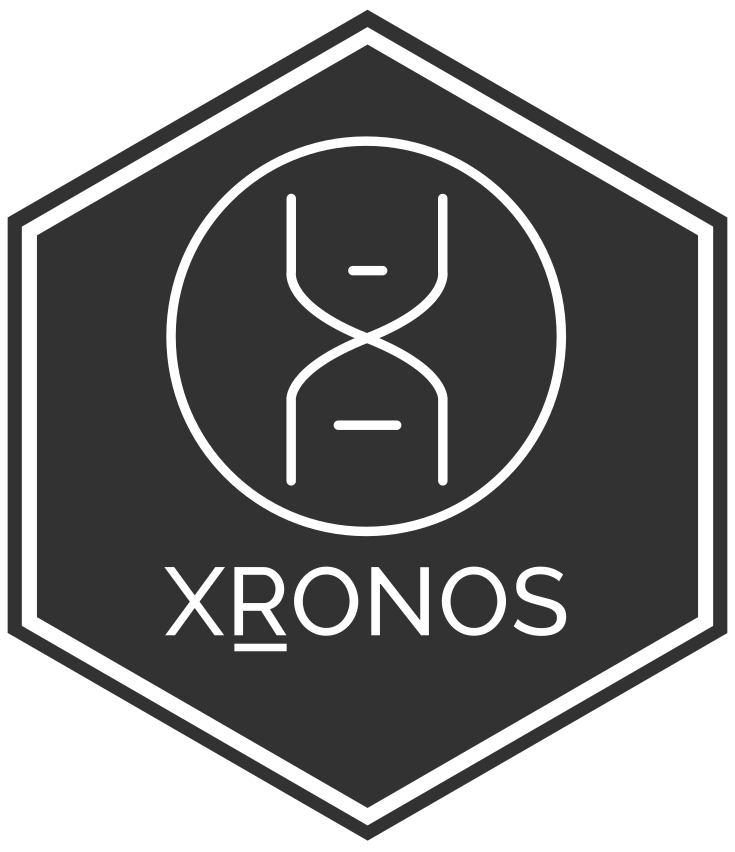

# xronos <a href="https://r.xronos.ch"></a>

<!-- badges: start -->
[](https://www.repostatus.org/#active)
[](https://CRAN.R-project.org/package=xronos)
[](https://github.com/xronos-ch/xronos.R/actions/workflows/R-CMD-check.yaml)
[](https://app.codecov.io/gh/xronos-ch/xronos.R?branch=master)
[](https://zenodo.org/badge/latestdoi/207299008)
<!-- badges: end -->

An R client to [XRONOS](https://xronos.ch), a worldwide database of chronological information from archaeological contexts, including radiocarbon and dendrochronological data.

## Installation


You can install the xronos R package from [CRAN](https://CRAN.R-project.org) with:

``` r
install.packages("xronos")
```

You can also install the development version of xronos using the [remotes](https://remotes.r-lib.org/) package:

``` r
remotes::install_github("xronos-ch/xronos.R")
```

## Usage

Use `chron_data()` to get chronological data, using any of the search parameters supported by [the XRONOS API](https://xronos.ch/api):

``` r
chron_data(country = "Switzerland", material = c("charcoal", "bone"))
```

For further usage, see the [introductory vignette](https://r.xronos.ch/articles/xronos.html) (`vignette("xronos")`).
